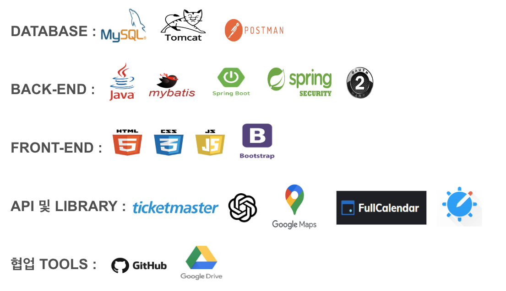
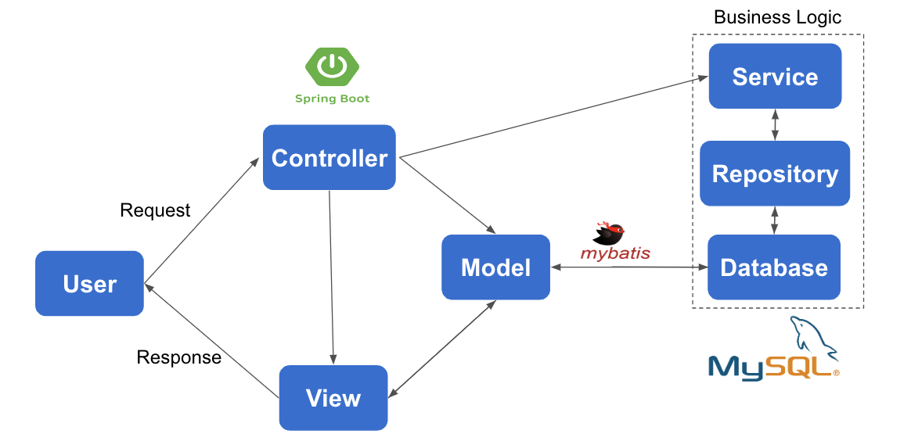

# 🛫 프로젝트명: TRAVEL with 🛬

# Team D.Error</h1>

● 이종현 
● 장고운 
● 서현기 
● 김종선 
● 임승빈

### 기획 의도

● 효율적인 정보 수집: 사용자는 단 한 번의 조회를 통해 여행하고자 하는 나라의 다양한 관광지나 공연 정보를 손쉽게 찾을 수 있습니다. 이를 통해 사용자는 복잡한 여행 정보 검색 과정을 단순화하고 효율적으로 여행 계획을 수립할 수 있습니다. 
● 일정 관리의 간편함: 사용자는 원하는 여행지나 이벤트를 한눈에 확인하고 일정에 추가할 수 있습니다. 이로써 여행 일정을 쉽게 조직하고 개인화된 계획을 세울 수 있습니다. 
● AI검색을 통한 추천 서비스: 우리의 서비스는 사용자에게 AI검색을 통한 여행지 추천목록을 제공합니다. 키워드 검색을 통해 AI가 여행지 추천을 제공함으로써, 사용자는 새로운 여행 목적지를 발견하고 다양한 경험을 즐길 수 있습니다. 
● 여행커뮤니티 제공: 여행계획을 세우는 사람들끼리 경험을 공유하고 정보를 교환할 수 있는 플랫폼을 제공합니다. 
● 총론적으로, 우리의 기획은 사용자들이 여행 정보를 빠르고 쉽게 찾아가며, 그들만의 특별한 여행 경험을 만들어가기 위한 지원을 목표로 합니다. 

## ✈**TRAVEL with 소개**

Treavel with 는 **파편화된 해외 여행 정보를 한 사이트 내에서 모두 볼 수 있도록 하고 맞춤화된 방식으로 일정을 계획하고 경험할 수 있도록 제작한 웹사이트**입니다.

Treavel with 는 한 번의 조회로 다양한 여행지와 공연 정보를 제공하여 여행 계획을 단순화하고, 일정 관리를 용이하게 하며, AI 검색으로 개인화된 여행지 추천을 제공합니다. 또한, 여행 커뮤니티를 통해 정보 교환을 가능하게 하여, 사용자가 빠르고 쉽게 특별한 여행 경험을 만들 수 있도록 지원합니다.

## 😀**팀원 소개**

|팀원|링크|역할|
|------|---|---|
|이종현|깃허브|버전 관리 및 DB 설계|
|||챗봇 도우미 구현|
|서현기|깃허브|홈, 항공, 숙박, 캘린더 페이지 구현|
|||API활용한 페이징 구현, 캘린더 CRUD 구현|
|임승빈|깃허브|로그인 및 회원가입|
|||회원페이지|
|장고운|깃허브|게시판(공지사항, 자유, 공유) CRUD 구현|
|||검색창, 목록필터, 페이징 구현|
|김종선|깃허브|이벤트 정보 조회, 페이징 구현|
|||이벤트 상세 정보 페이지, 일정 추가 구현|

## 🛠**기술 스텍**

## 📆**개발 기간**

**2023.11.20 ~ 2023.12.27(총 5주)**

|주차 |구분 |활동|
|:----:|:----:|:----|
|1주차|사전기획   |  프로젝트 주제 선정 및 기획안 작성  | 
|2주차|데이터 수집   |  해외공연, 관광지 API 수집  |  
||   |  항공편, 숙박 API수집  |
|3주차|데이터 전처리   |  데이터 정제 및 정규화  |  
|4주차|모델링   |  기본  CSS 작성  |  
|5주차|서비스 구축   |  웹 서비스 시스템 설계| 
|||최적화, 오류 수정| 

## 🔄**시스템 설계**

시스템 설계는 SpringBoot Framework를 통한 MVC 패턴으로 작성되었습니다. 
 Controller는 세부적으로 Business Logic을 따라 작동하고 있습니다.
 Database는 MySQL을 사용하였고 Model과 Database의 Mapping을 위해 mybatis를 사용하였습니다.
## ❤**서비스 기능 소개**

#### 로그인

---

#### 이벤트

---

#### 항공

---

#### 숙박

---

#### 달력

---

#### 게시판

---

#### 도우미

---

### 마이페이지

---
